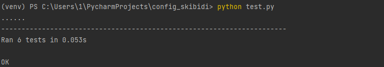

# config
config skibidi

# Вариант №12

# Задание №1

Разработать эмулятор для языка оболочки ОС. Необходимо сделать работу 
эмулятора как можно более похожей на сеанс shell в UNIX-подобной ОС. 
Эмулятор должен запускаться из реальной командной строки, а файл с 
виртуальной файловой системой не нужно распаковывать у пользователя. 
Эмулятор принимает образ виртуальной файловой системы в виде файла формата 
zip. Эмулятор должен работать в режиме GUI.

Конфигурационный файл имеет формат json и содержит:

• Имя компьютера для показа в приглашении к вводу.

• Путь к архиву виртуальной файловой системы.

• Путь к стартовому скрипту.

Стартовый скрипт служит для начального выполнения заданного списка 
команд из файла.
Необходимо поддержать в эмуляторе команды ls, cd и exit, а также 
следующие команды:
1. cat.
2. rmdir.
3. head.

Все функции эмулятора должны быть покрыты тестами, а для каждой из 
поддерживаемых команд необходимо написать 3 теста.
## Описание кода
# Обзор функционала
1. Чтение конфигурации: Параметры (имя хоста, путь к ZIP-архиву и лог-файлу) загружаются из JSON-конфигурационного файла.

2. Виртуальная файловая система: Создается файловая структура на основе содержимого ZIP-архива, с поддержкой операций над файлами и папками.

3. Логирование действий: Все введенные команды и действия записываются в XML-файл с временными метками.

4. Интерфейс командной строки: Пользователь взаимодействует с оболочкой через графический терминал, построенный на библиотеке tkinter.
# Детальный разбор кода
1. Функция read_config(config_path)
Читает файл JSON по указанному пути и извлекает параметры:

* hostname (имя хоста),

* vfs_path (путь к ZIP-файлу),

* log_path (путь к XML-файлу для логирования).
2. Функция log_action(log_path, action)
Логирует действие пользователя в XML-файл:

* Проверяет существование и валидность лог-файла.
* Добавляет новый <event> с полями:
  * <action>: команда или операция.
  * <timestamp>: время выполнения.
Если лог-файл отсутствует, создается новый.
3. Класс VirtualFileSystem
Основной класс, управляющий виртуальной файловой системой.

Атрибуты:
* root: корневой каталог VFS (MyVirtualMachine).
* current_path: текущий каталог, изначально совпадает с root.
Методы:
* __init__(zip_path)
Проверяет наличие ZIP-файла. Если файл существует, извлекает его содержимое в директорию root.

* extract_zip(zip_path)
Извлекает все файлы из ZIP-архива в корневую папку root.

* list_directory()
Сканирует текущую директорию и возвращает список файлов и папок с их типами, размерами и датами изменения.

* change_directory(path)
Переходит в указанную директорию:

Поддерживает команды .. (возврат на уровень выше).
Проверяет существование папки перед переходом.
* get_relative_path()
Возвращает относительный путь текущей директории от корня.

* read_file(file_name)
Читает содержимое указанного файла. Обрабатывает исключения, связанные с отсутствием файла или неподдерживаемой кодировкой.

* remove_directory(dirname)
Удаляет пустую директорию. Если директория не пуста или не существует, выбрасывает ошибку.

* read_head(filename, n)
Читает первые n строк из указанного файла.
4. Обработчики команд
Функции для выполнения команд оболочки:

* ls(vfs)
Возвращает содержимое текущей директории.

* cd(vfs, path)
Переходит в указанную директорию. Обрабатывает ошибки, связанные с некорректными путями.

* cat(vfs, file_name)
Возвращает содержимое файла.

* rmdir(vfs, dirname)
Удаляет указанную директорию.

* head(vfs, filename, n)
Возвращает первые n строк указанного файла.

5. Функция run_shell(hostname, vfs_path, log_path)
Запускает главный цикл командной оболочки с графическим интерфейсом.

Основные элементы:
* vfs: Экземпляр класса VirtualFileSystem, инициализируемый указанным ZIP-архивом.

* get_prompt()
Формирует строку приглашения в стиле:

* handle_command(event=None)
Обрабатывает ввод пользователя:

* Считывает команду.
* Логирует ее.
* Вызывает соответствующую функцию (ls, cd, cat, и т.д.).
* Отображает результат выполнения.
Интерфейс с использованием tkinter:
* Создает окно с элементом ScrolledText, имитирующим терминал.
* Обрабатывает нажатие клавиши Enter для выполнения команды.
6. Точка входа
Если файл запускается как главный скрипт:

* Загружается конфигурация из config.json.
* Запускается оболочка с заданными параметрами.
## Tests
Все тесты прогнаны корректно

